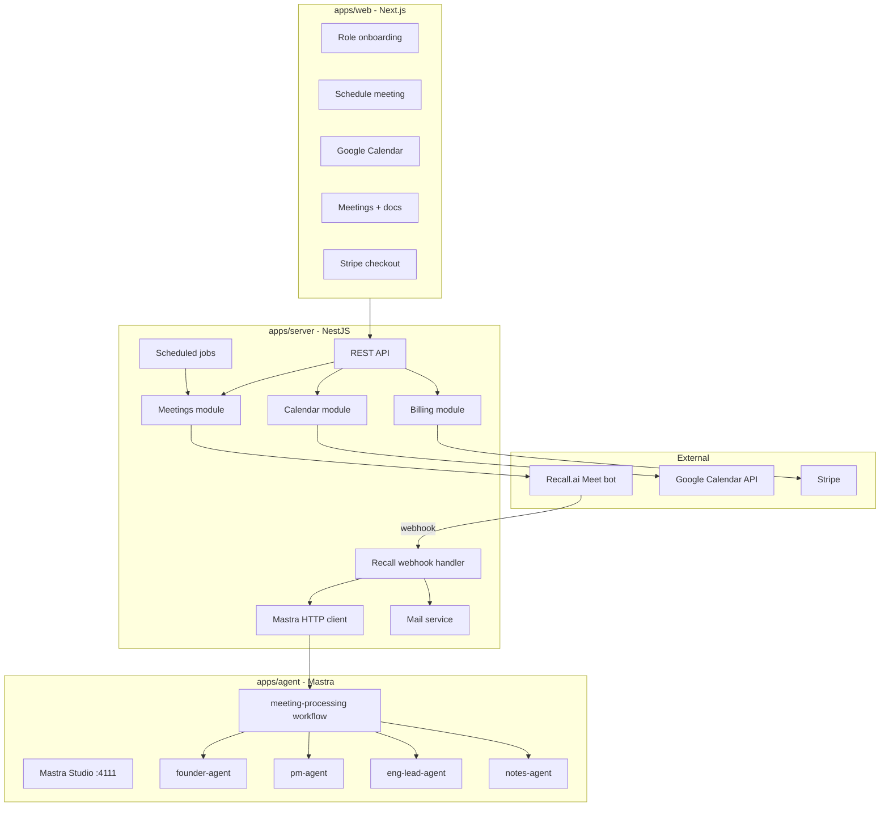
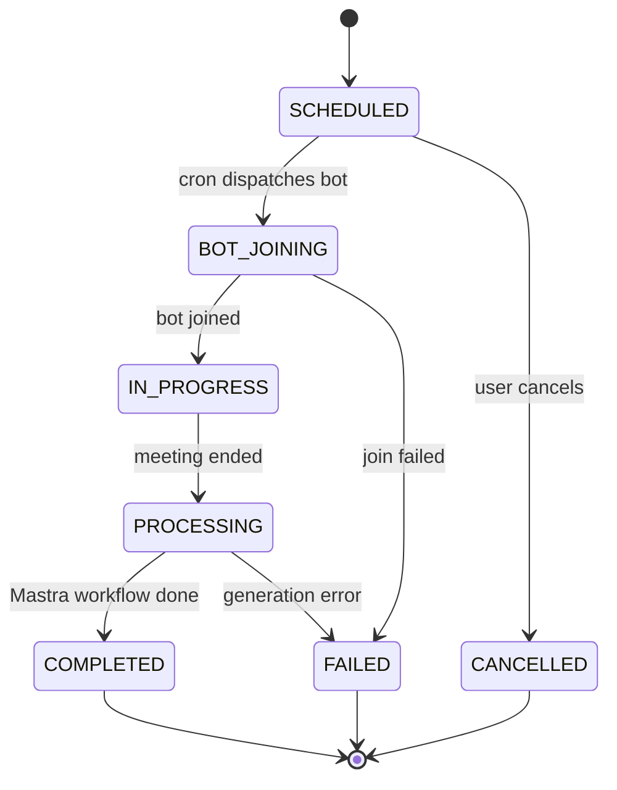

# AI Meeting Agent SaaS — Design Spec

**Date:** 2026-05-29  
**Status:** Approved  
**Repo:** ai-meeting-agent

## Summary

Build a fullstack SaaS that sends an AI bot to join Google Meet calls, generates detailed meeting notes and role-based
structured documents (PRD, spec, or RFC), and bills users via Stripe using a simple minutes-based subscription model.

The product uses the existing monorepo (`apps/web`, `apps/server`, Prisma) and adds a new Mastra app (`apps/agent`) for
AI orchestration. NestJS remains the system of record for users, meetings, billing, and calendar integration.

## Product decisions (locked)

| Area            | Decision                                                                   |
| --------------- | -------------------------------------------------------------------------- |
| Join model      | Live bot joins as a meeting participant                                    |
| Platform (v1)   | Google Meet only                                                           |
| Personalization | User picks persona at onboarding → tailored doc output                     |
| Scheduling      | Manual (URL + time) + Google Calendar sync                                 |
| Billing         | Free: 10 min/month · Pro: ~300 min/month @ ~$19/mo · hard stop, no overage |
| Delivery        | In-app viewer + email when processing completes                            |
| AI layer        | Mastra (workflows + role agents) in `apps/agent`                           |
| Bot provider    | Recall.ai (or equivalent Meeting BaaS)                                     |

## Goals

- User schedules a Google Meet; bot joins at the scheduled time and captures the meeting.
- After the meeting, Mastra generates meeting notes, key points, and a persona-specific structured document.
- Users see results in the dashboard and receive an email with a summary and link.
- Stripe manages Pro subscriptions; minute usage resets each billing cycle.
- Role-based outputs without separate apps: Founder, Product Manager, Engineering Lead.

## Non-Goals (v1)

- Zoom / Microsoft Teams support
- Team workspaces or shared billing accounts
- Markdown/PDF export (in-app + email only)
- Pay-as-you-go minute top-ups or automatic overage billing
- Real-time live notes during the meeting
- Chat-with-meeting feature (existing chat agent may be extended later)

## Architecture



### Monorepo layout

| App                     | Responsibility                                                 |
| ----------------------- | -------------------------------------------------------------- |
| `apps/web`              | UI: onboarding, scheduling, dashboard, billing                 |
| `apps/server`           | Auth, meetings CRUD, Stripe, calendar, webhooks, Mastra client |
| `apps/agent`            | Mastra agents, workflows, prompts, Studio dev server           |
| `packages/db`           | Prisma schema (extended)                                       |
| `packages/shared-types` | Shared enums, Zod schemas                                      |

NestJS is the **system of record**. Mastra owns **AI intelligence**. A separate `apps/agent` app avoids ESM/CommonJS
conflicts (Mastra requires ES2022 modules).

## Data model

### Enums

```prisma
enum UserPersona {
  SOLO_FOUNDER
  PRODUCT_MANAGER
  ENGINEERING_LEAD
}

enum SubscriptionPlan {
  FREE
  PRO
}

enum MeetingStatus {
  SCHEDULED
  BOT_JOINING
  IN_PROGRESS
  PROCESSING
  COMPLETED
  FAILED
  CANCELLED
}

enum MeetingSource {
  MANUAL
  GOOGLE_CALENDAR
}
```

### New / extended models

**User (extended)**

- `persona UserPersona?`
- `onboardingCompleted Boolean @default(false)`
- Relations: `subscription`, `meetings`, `calendarConnection`, `usagePeriod`

**Subscription** — synced from Stripe webhooks

| Field                  | Purpose                               |
| ---------------------- | ------------------------------------- |
| `userId`               | FK to User (unique)                   |
| `stripeCustomerId`     | Stripe customer ID                    |
| `stripeSubscriptionId` | Active subscription ID (null on Free) |
| `plan`                 | FREE or PRO                           |
| `status`               | active / canceled / past_due          |
| `currentPeriodStart`   | Billing cycle start                   |
| `currentPeriodEnd`     | Billing cycle end                     |

**UsagePeriod** — minute balance per billing cycle

| Field             | Purpose                          |
| ----------------- | -------------------------------- |
| `userId`          | FK to User (unique)              |
| `minutesIncluded` | 10 (Free) or 300 (Pro)           |
| `minutesUsed`     | Running total for current period |
| `periodStart`     | Cycle start                      |
| `periodEnd`       | Cycle end                        |

**Meeting**

| Field             | Purpose                                |
| ----------------- | -------------------------------------- |
| `userId`          | Owner                                  |
| `title`           | Meeting name                           |
| `meetUrl`         | Google Meet link                       |
| `scheduledAt`     | When bot should join                   |
| `durationMinutes` | Actual length (set after meeting ends) |
| `status`          | MeetingStatus                          |
| `source`          | MANUAL or GOOGLE_CALENDAR              |
| `recallBotId`     | External bot reference                 |
| `googleEventId`   | Calendar event ID (if applicable)      |
| `transcript`      | Raw transcript from Recall             |
| `notes`           | Generated meeting notes (Markdown)     |
| `structuredDoc`   | Role-based doc (PRD / spec / RFC)      |
| `keyPoints`       | JSON array of bullet points            |
| `failureReason`   | Error message if FAILED                |

**CalendarConnection**

| Field          | Purpose                        |
| -------------- | ------------------------------ |
| `userId`       | FK to User (unique)            |
| `accessToken`  | Encrypted OAuth token          |
| `refreshToken` | Encrypted refresh token        |
| `expiresAt`    | Token expiry                   |
| `googleEmail`  | Connected Google account email |

### Meeting status lifecycle



## Minute metering

1. **What counts:** Wall-clock minutes from bot join to bot leave, rounded up to the nearest minute.
2. **When deducted:** After meeting ends, before Mastra processing starts.
3. **Pre-check:** Before dispatching bot, verify `minutesUsed + estimatedDuration ≤ minutesIncluded`.
   - Manual schedule: user enters expected duration (default estimate: 30 min for pre-check).
   - Calendar: use event duration from Google Calendar API.
4. **Hard stop:** If balance is 0, block new meetings and show upgrade CTA.
5. **Mid-meeting exhaustion:** Bot stays until meeting ends; user receives warning email; next meeting blocked until
   upgrade or next cycle reset.
6. **Reset:** On Stripe `invoice.paid` webhook → set `minutesUsed = 0`, update `minutesIncluded` by plan.

## User flows

### Onboarding

Sign up → pick persona (Founder / PM / Eng Lead) → dashboard with usage banner ("10 free minutes this month").

### Schedule manually

Dashboard → "New meeting" → enter Meet URL, title, date/time → balance check → create Meeting (SCHEDULED) → cron
dispatches Recall bot at `scheduledAt`.

### Schedule via Google Calendar

Settings → Connect Google Calendar (OAuth) → dashboard/calendar shows upcoming Meet events → user toggles "Send AI bot"
→ create Meeting linked to `googleEventId` → auto-dispatch at event start.

### Meeting lifecycle

SCHEDULED → BOT_JOINING → IN_PROGRESS → (Recall webhook: bot left) → PROCESSING → NestJS calls Mastra workflow → save
notes + structuredDoc → COMPLETED → email with link.

### View results

Dashboard → meeting list → meeting detail with tabs: Meeting Notes | PRD/Doc | Key Points.

### Upgrade

Hit minute limit or click Upgrade → Stripe Checkout (Pro $19/mo) → webhook updates Subscription + UsagePeriod → 300
minutes available.

## Stripe billing

### Products

| Plan | Stripe                        | Minutes/month | Price  |
| ---- | ----------------------------- | ------------- | ------ |
| Free | App-managed (no Stripe sub)   | 10            | $0     |
| Pro  | `price_pro_monthly` recurring | 300           | $19/mo |

### Checkout flow

1. User clicks Upgrade → `POST /api/billing/checkout` creates Stripe Checkout Session (mode: `subscription`).
2. Success redirect → `/dashboard?upgraded=true`.
3. Webhooks at `POST /api/billing/webhook` (`@Public()`):
   - `checkout.session.completed` → create/update Subscription, set PRO
   - `invoice.paid` → reset UsagePeriod
   - `customer.subscription.updated` → sync status
   - `customer.subscription.deleted` → downgrade to FREE

### Environment variables

```
STRIPE_SECRET_KEY
STRIPE_WEBHOOK_SECRET
STRIPE_PRO_PRICE_ID
RECALL_API_KEY
RECALL_WEBHOOK_SECRET
MASTRA_URL=http://localhost:4111
GOOGLE_CALENDAR_CLIENT_ID
GOOGLE_CALENDAR_CLIENT_SECRET
GOOGLE_CALENDAR_REDIRECT_URI
TOKEN_ENCRYPTION_KEY
```

## API surface (NestJS)

### Meetings

| Method | Route                          | Purpose                          |
| ------ | ------------------------------ | -------------------------------- |
| POST   | `/api/meetings`                | Schedule manual meeting          |
| GET    | `/api/meetings`                | List user's meetings (paginated) |
| GET    | `/api/meetings/:id`            | Meeting detail + notes/doc       |
| PATCH  | `/api/meetings/:id/cancel`     | Cancel before bot joins          |
| POST   | `/api/meetings/webhook/recall` | Recall.ai webhook (`@Public()`)  |

### Calendar

| Method | Route                               | Purpose              |
| ------ | ----------------------------------- | -------------------- |
| GET    | `/api/calendar/connect`             | Start Google OAuth   |
| GET    | `/api/calendar/callback`            | OAuth callback       |
| GET    | `/api/calendar/events`              | Upcoming Meet events |
| POST   | `/api/calendar/events/:eventId/bot` | Enable bot for event |

### Billing

| Method | Route                   | Purpose                                  |
| ------ | ----------------------- | ---------------------------------------- |
| GET    | `/api/billing/usage`    | `{ minutesUsed, minutesIncluded, plan }` |
| POST   | `/api/billing/checkout` | Stripe Checkout URL                      |
| POST   | `/api/billing/portal`   | Stripe Customer Portal                   |
| POST   | `/api/billing/webhook`  | Stripe events (`@Public()`)              |

### Onboarding

| Method | Route                   | Purpose                         |
| ------ | ----------------------- | ------------------------------- |
| POST   | `/api/users/onboarding` | Set persona, mark complete      |
| GET    | `/api/users/me`         | Include persona + usage summary |

### Internal (NestJS → Mastra)

POST `{MASTRA_URL}/api/workflows/meetingProcessing/start` with
`{ transcript, userRole, meetingTitle, attendees?, durationMinutes }`.

## Mastra (`apps/agent`)

### Project structure

```
apps/agent/
├── src/mastra/
│   ├── index.ts
│   ├── agents/
│   │   ├── founder-agent.ts
│   │   ├── pm-agent.ts
│   │   ├── eng-lead-agent.ts
│   │   └── notes-agent.ts
│   ├── workflows/
│   │   └── meeting-processing.ts
│   └── prompts/
│       ├── founder-prd.md
│       ├── pm-prd.md
│       └── eng-rfc.md
├── package.json          # "dev": "mastra dev"
└── tsconfig.json         # ES2022 modules required
```

### Role agents

| Agent            | Output                    | Sections                                                                        |
| ---------------- | ------------------------- | ------------------------------------------------------------------------------- |
| `founder-agent`  | Lightweight spec          | Summary, Key Decisions, Action Items, Rough Spec                                |
| `pm-agent`       | Full PRD                  | Problem, Users, Requirements (MoSCoW), Metrics, Open Questions, Timeline        |
| `eng-lead-agent` | Technical RFC             | Architecture Decisions, Technical Discussion, Action Items, Blockers, RFC Draft |
| `notes-agent`    | Shared notes + key points | Attendees, Topics, Decisions, Action Items                                      |

### `meeting-processing` workflow

```
Input:  { transcript, userRole, meetingTitle, attendees?, durationMinutes }

Step 1: normalize-transcript     → clean text, speaker labels
Step 2: extract-key-points         → JSON array (notes-agent)
Step 3: generate-meeting-notes     → Markdown (notes-agent)
Step 4: generate-structured-doc      → branch by userRole:
          SOLO_FOUNDER      → founder-agent
          PRODUCT_MANAGER   → pm-agent
          ENGINEERING_LEAD  → eng-lead-agent

Output: { notes, structuredDoc, keyPoints }
```

**Model:** Use Mastra model router format (`provider/model-name`). Verify provider and model via
`scripts/provider-registry.mjs` at implementation time. Default candidate: `google/gemini-2.5-pro` or `openai/gpt-4.1`
(single provider for v1).

**Dev:** `pnpm dev` in `apps/agent` → Mastra Studio at `http://localhost:4111`.

## Frontend (`apps/web`)

### Routes

| Route               | Purpose                                            |
| ------------------- | -------------------------------------------------- |
| `/onboarding`       | Persona picker (first login)                       |
| `/dashboard`        | Usage bar, upcoming/recent meetings, quick actions |
| `/meetings/new`     | Schedule form (Meet URL, title, datetime)          |
| `/meetings/[id]`    | Meeting detail (Notes / Doc / Key Points tabs)     |
| `/calendar`         | Google events + bot toggle                         |
| `/settings`         | Persona change, calendar connect/disconnect        |
| `/settings/billing` | Plan, usage, upgrade, Stripe portal                |

### Key components

- `UsageBar` — minutes used/included + upgrade CTA
- `MeetingCard` — title, time, status badge, duration
- `ScheduleForm` — Meet URL validation, datetime picker, minute pre-check
- `MeetingDetail` — tabbed Markdown viewer
- `CalendarEventList` — events with Meet links + bot toggle
- `PersonaPicker` — Founder / PM / Eng Lead cards
- `UpgradeModal` — triggered on insufficient minutes

Follow existing patterns: `ApiClient` services, TanStack Query, `@repo/ui`, `react-hook-form` + Zod, `sonner` toasts.

## Error handling

### Bot join failures

| Scenario                            | Behavior                                        |
| ----------------------------------- | ----------------------------------------------- |
| Invalid Meet URL                    | Validate on schedule; reject with clear message |
| Bot denied entry                    | FAILED; email with admit-bot instructions       |
| Bot timeout (no join within 10 min) | FAILED; no minutes charged                      |
| Recall API down                     | Retry 3× with backoff; then FAILED + log alert  |

### Generation failures

| Scenario              | Behavior                                       |
| --------------------- | ---------------------------------------------- |
| Empty transcript      | FAILED; email with troubleshooting             |
| Mastra workflow error | Retry once; then FAILED; minutes still charged |
| Mastra service down   | Queue in DB; retry when agent is back          |

### Billing edge cases

| Scenario                    | Behavior                                                     |
| --------------------------- | ------------------------------------------------------------ |
| 0 minutes, schedule attempt | 403 `{ code: 'INSUFFICIENT_MINUTES' }` + upgrade link        |
| Subscription lapses         | Finish in-progress meetings; block new; downgrade on webhook |
| Invalid webhook signature   | 400; log; do not mutate state                                |

### Email notifications

| Event                             | Email                       |
| --------------------------------- | --------------------------- |
| Meeting completed                 | Summary + link to full doc  |
| Meeting failed                    | Reason + retry instructions |
| Minutes nearly exhausted (≤2 min) | Warning + upgrade CTA       |
| Minutes exhausted                 | Block notice + upgrade CTA  |

Reuse existing `@nestjs-modules/mailer` + HTML templates.

## Background jobs

| Job                | Trigger           | Action                                                         |
| ------------------ | ----------------- | -------------------------------------------------------------- |
| `dispatch-bot`     | Cron every minute | Find SCHEDULED meetings where `scheduledAt ≤ now` → Recall API |
| `retry-processing` | Cron every 5 min  | Retry PROCESSING meetings stuck >10 min                        |

v1 uses `@nestjs/schedule` — no Redis required.

## Security

- Encrypt Google OAuth tokens at rest (`TOKEN_ENCRYPTION_KEY`)
- Validate Recall and Stripe webhook signatures
- Never expose `recallBotId` or raw tokens to frontend
- Rate-limit meeting creation (e.g. 10/day on Free)

## Implementation order

1. Scaffold `apps/agent` — Mastra setup, agents, workflow, Studio testing with sample transcripts
2. Prisma schema — new models + migration
3. Meetings module — CRUD, Recall integration, webhooks, cron dispatch
4. Billing module — Stripe Checkout, webhooks, usage metering
5. Calendar module — Google OAuth, event listing, bot toggle
6. Frontend — onboarding → dashboard → schedule → detail → billing
7. Email templates — completion, failure, low-minutes
8. E2E smoke test — schedule → bot → webhook → Mastra → email

## Testing strategy

- **Mastra:** Test workflow in Studio with fixture transcripts per persona
- **Backend:** Unit tests for minute metering, webhook handlers, billing state transitions
- **Integration:** Mock Recall + Mastra for meeting lifecycle e2e
- **Frontend:** RTL tests for ScheduleForm validation, UsageBar states, UpgradeModal trigger

## Open items for implementation plan

- Final Recall.ai API contract (bot create, webhook payload shape)
- Single LLM provider choice (verify via Mastra provider registry)
- Google Calendar OAuth scopes (read events + Meet link detection)
