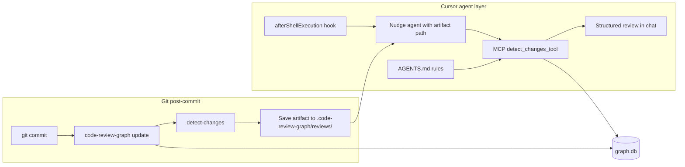

# Code-Review-Graph Post-Commit Integration

**Date:** 2026-05-29  
**Status:** Approved  
**Repo:** ai-meeting-agent

## Summary

Integrate [code-review-graph](https://github.com/) (CRG) into ai-meeting-agent with a dual-layer approach:

1. **Git post-commit hook** — incrementally updates the knowledge graph and saves a review artifact per commit.
2. **Cursor agent layer** — project rules plus a shell hook nudge agents to run MCP-based structured review after
   commits.

CRG MCP tools remain the **primary source** for codebase exploration and change review. File search (Grep/Glob/Read) is
a fallback only when the graph does not cover what is needed.

## Goals

- Keep the local knowledge graph current after every commit.
- Persist machine- and human-readable review artifacts at `.code-review-graph/reviews/<commit-sha>.{json,md}`.
- Instruct Cursor agents to run CRG MCP review workflow after commits (automatic nudge + documented rules).
- Never block commits if CRG is missing or fails.

## Non-Goals

- CI/GitHub Actions integration (future option).
- Live graph sync on every file save (`afterFileEdit` hooks) — deferred unless commit-only updates prove too slow.
- Committing graph data or review artifacts to version control.

## Architecture



## Components

| File                                | Purpose                                                                     |
| ----------------------------------- | --------------------------------------------------------------------------- |
| `scripts/crg-post-commit.sh`        | Update graph, run detect-changes, save JSON + markdown artifacts            |
| `.husky/post-commit`                | Invoke post-commit script after successful commits                          |
| `.cursor/hooks.json`                | Register `afterShellExecution` hook for `git commit`                        |
| `.cursor/hooks/crg-after-commit.sh` | Inject `additional_context` pointing agent to artifact + AGENTS.md workflow |
| `.cursor/mcp.json`                  | Register CRG MCP server (`uvx code-review-graph serve`)                     |
| `AGENTS.md`                         | CRG-first exploration rules and post-commit review workflow                 |
| `.gitignore`                        | Ignore `.code-review-graph/` (graph DB + local review artifacts)            |

## Git Post-Commit Hook

### Script: `scripts/crg-post-commit.sh`

Logic:

1. Resolve `REPO_ROOT` via `git rev-parse --show-toplevel`.
2. Resolve `SHA` via `git rev-parse HEAD`.
3. Ensure `.code-review-graph/reviews/` exists.
4. If `code-review-graph` is not on PATH, print warning to stderr and exit 0.
5. Run `code-review-graph update --skip-flows --repo "$REPO_ROOT"` (fast incremental update).
6. Run `code-review-graph detect-changes --repo "$REPO_ROOT"` and write JSON to `.code-review-graph/reviews/$SHA.json`.
7. Generate `.code-review-graph/reviews/$SHA.md` from the JSON `summary` field plus metadata (SHA, timestamp, base ref).

### Husky: `.husky/post-commit`

- Source husky shim.
- Call `scripts/crg-post-commit.sh`.
- Runs after commit succeeds; never blocks or modifies the commit.

### Performance

- Use `--skip-flows` on incremental update to keep post-commit latency low (~1–3s on this repo).
- Full postprocess (`code-review-graph postprocess`) remains available for manual or scheduled runs.

### Edge Cases

| Scenario                            | Behavior                                                |
| ----------------------------------- | ------------------------------------------------------- |
| First commit (no `HEAD~1`)          | CRG falls back to worktree diff; artifact still saved   |
| Docs-only / empty functional change | Artifact with `risk_score: 0`; agent summarizes briefly |
| Merge/rebase commits                | Standard diff parent→HEAD                               |
| CRG not installed                   | Warning printed; exit 0                                 |

## Cursor Agent Layer

### MCP: `.cursor/mcp.json`

```json
{
  "mcpServers": {
    "code-review-graph": {
      "command": "uvx",
      "args": ["code-review-graph", "serve"],
      "type": "stdio"
    }
  }
}
```

### Rules: `AGENTS.md`

Include CRG MCP tool guidance (when to use graph tools first, key tools table, workflow).

**Post-commit agent workflow** (after any commit lands or when user asks):

1. Read `.code-review-graph/reviews/<HEAD-sha>.md` (fallback: `.json`).
2. Call `detect_changes_tool` with `base: HEAD~1`, `include_source: false`, `max_depth: 2`, `repo_root` set to this
   repo.
3. If `review_priorities` is non-empty, `risk_score` is elevated, or user wants line-level detail, call
   `get_review_context_tool` with `include_source: true` and `max_lines_per_file` of 120–200 for changed paths only.
4. Docs/markdown-only commits may show zero graph nodes and risk 0 — summarize for the user instead of forcing broad
   file reads.

### Hook: `.cursor/hooks.json`

```json
{
  "version": 1,
  "hooks": {
    "afterShellExecution": [
      {
        "command": ".cursor/hooks/crg-after-commit.sh",
        "matcher": "git\\s+commit"
      }
    ]
  }
}
```

### Hook script: `.cursor/hooks/crg-after-commit.sh`

- Read JSON from stdin.
- If command matches `git commit`, resolve `HEAD` SHA.
- Return JSON with `additional_context` instructing the agent to follow the AGENTS.md post-commit workflow and pointing
  to `.code-review-graph/reviews/<sha>.md`.
- Exit 0 on all paths (fail open).
- Timeout: 15 seconds in hooks.json.

## Error Handling

| Scenario                    | Behavior                                                            |
| --------------------------- | ------------------------------------------------------------------- |
| `code-review-graph` missing | Warn; git commit and Cursor session continue                        |
| Graph DB missing            | `update` bootstraps on first run                                    |
| Hook script error           | Exit 0 (fail open); log to stderr                                   |
| Cursor hook timeout         | Agent nudge skipped; AGENTS.md rules still apply when agent commits |

## Prerequisites

- `code-review-graph` CLI on PATH (recommended: `pipx install code-review-graph` or
  `uv tool install code-review-graph`).
- Husky already configured via `pnpm prepare`.
- Cursor with MCP and hooks support enabled.

## Testing Checklist

1. `git commit --allow-empty -m "test: crg hook"` creates `.code-review-graph/reviews/<sha>.json` and `.md`.
2. `code-review-graph status --repo .` shows refreshed `last_updated`.
3. Commit in Cursor integrated terminal triggers `additional_context` in agent session.
4. Agent asked to "review my last commit" uses `detect_changes_tool` before broad file reads.
5. With CRG binary unavailable, commit still succeeds and warning is printed.

## Files Changed

| Action | Path                                |
| ------ | ----------------------------------- |
| Create | `scripts/crg-post-commit.sh`        |
| Create | `.husky/post-commit`                |
| Create | `.cursor/hooks/crg-after-commit.sh` |
| Create | `.cursor/hooks.json`                |
| Create | `.cursor/mcp.json`                  |
| Create | `AGENTS.md`                         |
| Update | `.gitignore`                        |

No changes to existing `pre-commit`, `commit-msg`, or `pre-push` hooks.

## Future Enhancements

- **Approach 2:** Cursor `afterFileEdit` hook for live graph sync between commits.
- **Approach 3:** GitHub Action to run CRG on push and publish review summary.
- Periodic `code-review-graph postprocess` in a cron or weekly script for full flow/community detection.
